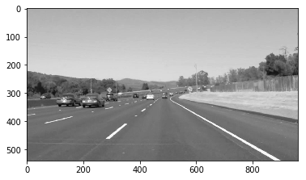
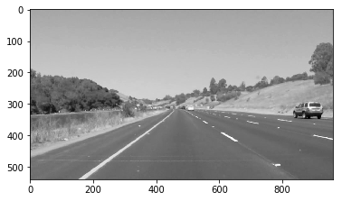
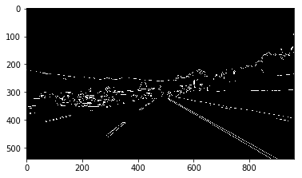
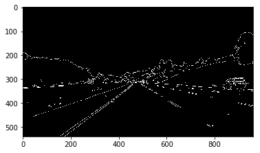
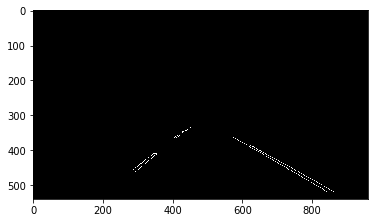
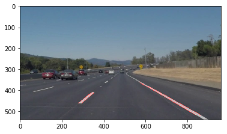
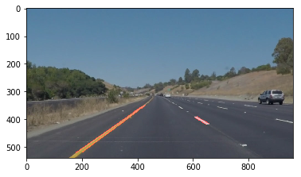
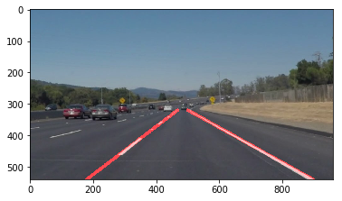
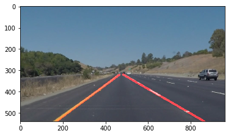

<!-- Improved compatibility of back to top link: See: https://github.com/othneildrew/Best-README-Template/pull/73 -->

<!--
*** Thanks for checking out the Best-README-Template. If you have a suggestion
*** that would make this better, please fork the repo and create a pull request
*** or simply open an issue with the tag "enhancement".
*** Don't forget to give the project a star!
*** Thanks again! Now go create something AMAZING! :D
-->

<!-- PROJECT SHIELDS -->
<!--
*** I'm using markdown "reference style" links for readability.
*** Reference links are enclosed in brackets [ ] instead of parentheses ( ).
*** See the bottom of this document for the declaration of the reference variables
*** for contributors-url, forks-url, etc. This is an optional, concise syntax you may use.
*** https://www.markdownguide.org/basic-syntax/#reference-style-links
-->

<!-- PROJECT LOGO -->
 

  <!---->

<h3 align="center">Lane Detection</h3>

  

    Computer Vision to detect lane lines on a road
     
    <a href="https://github.com/derekn4/PillClassification"><strong>Explore the docs »</strong></a>
     
  

<!-- TABLE OF CONTENTS -->

  
Table of Contents

  <ol>
    <li>
      <a href="#about-the-project">About The Project</a>
      <ul>
        <li><a href="#built-with">Built With</a></li>
      </ul>
    </li>
    <li>
      <a href="#pipeline">Pipeline</a>
      <ul>
        <li><a href="#gray-scale">Grayscale</a></li>
        <li><a href="#guassian-blur">Guassian Blur</a></li>
        <li><a href="#canny-edge-detection">Canny Edge Detection</a></li>
        <li><a href="#region-of-interest">Region of Interest</a></li>
        <li><a href="#hough-transform">Hough Transform</a></li>
        <li><a href="#annotate-image">Annotate image</a></li>
      </ul>
    </li>
    <li><a href="#contact">Contact</a></li>
  </ol>

<!-- ABOUT THE PROJECT -->
## About The Project
Lane line detection is crucial for self-driving cars. With Python and OpenCV, I was able to process video clips and identify lane lines.
The following techniques were used:
* Canny Edge Detection
* Region of Interest Selection
* Hough Transform Line Detection

With these techniques, I could process dash cam footage and annotate them highlighting lane lines

(<a href="#readme-top">back to top</a>)

### Built With

* [![Python][Python.org]][Python-url]
* [![OpenCV][opencv.org]][opencv-url]

(<a href="#readme-top">back to top</a>)

## Pipeline
- Install all necessary libraries to run pillImageDownload.py
- NOTE: the  National Library of Medicine consisted of 4,000 high-quality reference pills and 133,000 pictures captured by digital cameras on mobile phones.
  - ~2-3TB of data which we could not store or processes in GoogleColab

### Grayscale

Removing color channels allows for the Canny edge dectector to more effectively detect edges, since it uses changes in pixel intensity

    def grayscale(img):
        return cv2.cvtColor(img, cv2.COLOR_RGB2GRAY)

 

### Guassian Blur

Blurring the image smooths out the rough edges of the image which would be picked up later

    def gaussian_blur(img, kernel_size):
        return cv2.GaussianBlur(img, (kernel_size, kernel_size), 0)

### Canny Edge Detection

Highlights the edges of the image

    def canny(img, low_threshold, high_threshold):
        return cv2.Canny(img, low_threshold, high_threshold)
        
 

### Region of Interest

Cuts out portions of the image. In particular, for this project, it cuts out a triangle.

    def region_of_interest(img, vertices):
        #defining a blank mask to start with
        mask = np.zeros_like(img)   

        #defining a 3 channel or 1 channel color to fill the mask with depending on the input image
        if len(img.shape) > 2:
            channel_count = img.shape[2]  # i.e. 3 or 4 depending on your image
            ignore_mask_color = (255,) * channel_count
        else:
            ignore_mask_color = 255

        #filling pixels inside the polygon defined by "vertices" with the fill color    
        cv2.fillPoly(mask, vertices, ignore_mask_color)

        #returning the image only where mask pixels are nonzero
        masked_image = cv2.bitwise_and(img, mask)
        return masked_image

 

### Hough Transform

Extracts out the lines of an image through various parameters and annotates the image

    def avg_hough_lines(img, rho, theta, threshold, min_line_len, max_line_gap):
        x_size = img.shape[1]
        y_size = img.shape[0]

        lines = cv2.HoughLinesP(img, rho, theta, threshold, np.array([]), minLineLength=min_line_len, maxLineGap=max_line_gap)
        # Blank image with same resolution
        line_img = np.zeros((img.shape[0], img.shape[1], 3), dtype=np.uint8)

        left_x = []
        left_y = []
        right_x = []
        right_y = []
        # Determines which line correspond to which lane depending on slope
        for line in lines:
            for x1, y1, x2, y2 in line:
                m = (y2-y1)/(x2-x1)
                if m != 0 and m != np.inf and m != -np.inf:
                    if m > 0: # Right lane
                        right_x += [x1, x2]
                        right_y += [y1, y2]
                    else: # Left Lane
                        left_x += [x1, x2]
                        left_y += [y1, y2]

        avg_lines = list()
        # First checks if respective lane lines are present
        # Lines are created by least squares regression
        # Added for robustness when lane lines are not present/detected
        if len(left_x):
            left_m, left_b = np.polyfit(left_x, left_y, 1)
            avg_lines.append([lines_from_bound(left_m, left_b, y_size//2+50, y_size)])
        if len(right_x):
            right_m, right_b = np.polyfit(right_x, right_y, 1)
            avg_lines.append([lines_from_bound(right_m, right_b, y_size//2+50, y_size)])

        draw_lines(line_img, avg_lines, thickness=10)

        return line_img

    def lines_from_bound(m, b, y_lower, y_upper):
        """
        Arguments:
        m: Slope of the line
        b: Intercept of the time
        y_lower: Lower bound of y (Top bound of picture)
        y_upper: Upper bound of y (Bottom bound of picture)

        Returns the bounding box of a line
        """
        # Dervived from y=mx+b
        x1, y1 = (y_upper - b) / m, y_upper
        x2, y2 = (y_lower - b) / m, y_lower

        bounding_box = np.array([x1, y1, x2, y2])

        return bounding_box.astype(int)
        
 

### Annotate Image
- Extrapolation with Least Square Regression
 

<!-- CONTACT -->
## Contact

Derek Nguyen 
- [LinkedIn](https://www.linkedin.com/in/derekhuynguyen/) 
- [Email](derek.nguyen99@gmail.com)
  
Project Link: [https://github.com/derekn4/PillClassification](https://github.com/derekn4/PillClassification)

(<a href="#readme-top">back to top</a>)

<!-- MARKDOWN LINKS & IMAGES -->
<!-- https://www.markdownguide.org/basic-syntax/#reference-style-links -->
[Python.org]: https://www.python.org/static/img/python-logo.png
[Python-url]: https://www.python.org/about/website/
[opencv.org]: https://upload.wikimedia.org/wikipedia/commons/thumb/3/32/OpenCV_Logo_with_text_svg_version.svg/1200px-OpenCV_Logo_with_text_svg_version.svg.png
[opencv-url]: https://opencv.org/